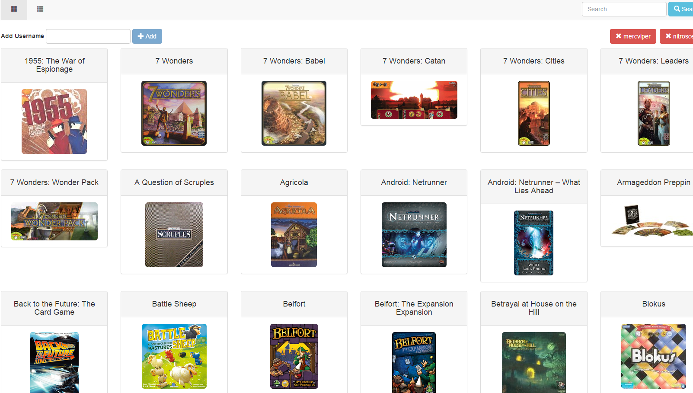

# bgg
Board Game Geek Collections app

## What is it?

It is a webapp to better view and manage multiple Board Game collections using data from BoardGameGeek.com. The goal is to use it to help manage choosing board games to play or bring to events.



## Setup
* Install RabbitMQ
* Install MongoDB
* Install Node.js/npm
* git clone this repo
* run `npm install` in the repo's directory

### Automated Setup

You have a few options for automated setup:

Linux/Mac OSX:

If you have Vagrant and Ansible installed, you can run the following comands to setup:

```
npm install
ansible-galaxy install nodesource.node
grunt create-vm
```

and when you want to deploy to it after making changes:

```
grunt deploy-vm
```

Please note when using a vm, some of the grunt features will not be available to you.

Windows:

```
./WindowsChocoInstall.ps1
```

This will install NodeJs, RabbitMQ, and MongoDB automatically using [Chocolatey](https://chocolatey.org).
Please note this isn't tested since I already have them installed. 
It may 'stomp' your version, so be careful if you already have them installed.

## Start the Server
```
grunt server
```

This will run both the collection processor (RabbitMQ based message queue) and the web server (express js)

Then visit the site locally at http://localhost:7080/

Changes made to the javascript/html should cause the browser to refresh the page.

## Listen/Test Process Collection Messages
```
grunt collectionProcessor
(In another Command Line) grunt kickoffCollection
```

This will kick off a test message and process it into RabbitMQ.

What are "Collection Messages"?

BGG requires you to wait while it processes a collection request. 
A message queue is used to ensure we properly wait for BGG to finish processing.

